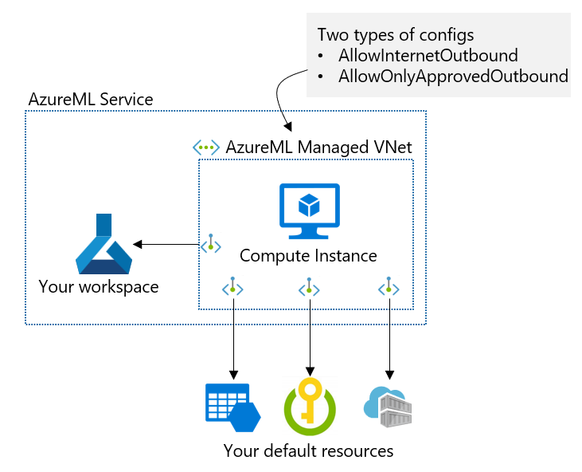
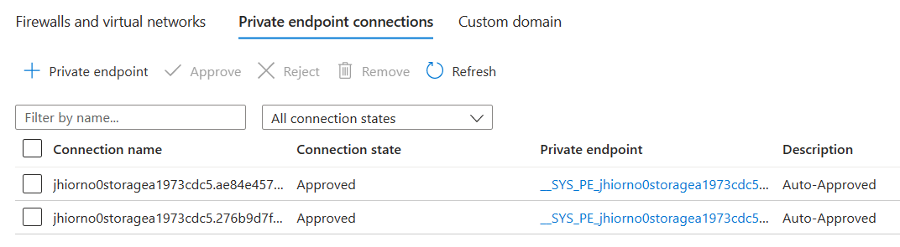

# Private Preview Phase 1

## Limitations and Prerequists
* Compute Instance with Public IP is the only supported compute type.
* FQDN outbound is not supported.
* Supported region is useast2 only.
* Make sure your subscription is allowlisted.

## What you will get



You can have an AzureML managed VNet with two configuration types.
* **AllowInternetOutbound**: Allow all internet oubound from AzureML managed VNet. You can have private endpoint connections to your private Azure resources.
* **AllowOnlyApprovedOutbound**: You can allow outbound only to the approved outbound. You can allow outbound using private endpoint, FQDN and service tag.

## CLI setup
1. Remove your Azure CLI AzureML extension if you have.

```Azure CLI
az extension remove -n ml
```

2. Install CLI ML extension for private preview

```Azure CLI
az extension add --source https://azuremlsdktestpypi.blob.core.windows.net/wheels/sdk-cli-v2/ml-0.0.83706329-py3-none-any.whl
```

## Create your new workspace (do not test this with your existing workspaces)

1. Create a workspace without managed network isolation

```Azure CLI
az login
az account set -s <subscriptionId>
az group create -g <new_rg_name> 
az ml workspace create -n <new_ws_name> -g <rg_name> --location eastus2 --managed-network Disabled
```

2. Enable manage network isolation

```Azure CLI
az ml workspace update -n <ws_name> -g <rg_name> --managed-network AllowInternetOutbound
```
or
```Azure CLI
az ml workspace update -n <ws_name> -g <rg_name> --managed-network AllowOnlyApprovedOutbound
```

## Confirm private endpoint connection to your default resources (storage, KV, ACR)

You can check private endpoint connections on Azure portal.



## Create private endpoints to access your private storage (optional)
You can create private endpoints to access your private resources. Below is an example to create a PE for an Azure storage.

```Azure CLI
> az ml workspace outbound-rule set --resource-group MyGroup --workspace-name MyWorkspace --rule MyStorage --type PrivateEndpoint --service-resource-id "/subscriptions/00000000-1111-2222-3333-444444444444/resourceGroups/MyGroup/providers/Microsoft.Storage/storageAccounts/MyAccount" --subresource-target blob
```
or
```Azure CLI
az ml workspace update --file workspace.yml --resource-group MyGroup
```
You can find a sample [peoutbound.yml](peoutbound.yml)

```YAML
name: MyWorkspace
managed_network:
  outbound_rules:
    MyStorage:
      type: PrivateEndpoint
      destination:
        service_resource_id: "/subscriptions/00000000-1111-2222-3333-444444444444/resourceGroups/MyGroup/providers/Microsoft.Storage/storageAccounts/MyAccount"
        subresource_target: "blob"
```

## Create your compute intance

Use [computeinstance.yml](computeinstance.yml) with your compute instance name and SSH key.
```Azure CLI
az ml compute create --file computeInstance.yml --resource-group <rg_name> --workspace-name <ws_name> 
```

You can create and copy your SSH key if you do not have it.

```CLI
ssh-keygen -m PEM -t rsa -b 4096
cat ~/.ssh/id_rsa.pub
```

## Connect to the compute instance using SSH

```Azure CLI
az ml compute connect-ssh --name <ci_name>--resource-group <rg_name> --workspace-name <ws_name> --private-key-file-path <your sshkey path>
```

## User jupyter notebook on the compute instance

TBU

## Optional: Create a service tag outbound

```Azure CLI
az ml workspace outbound-rule set --resource-group MyGroup --workspace-name MyWorkspace --rule MyAzureSerivce --type ServiceTag --service-tag DataFactory --port-ranges "80, 8080-8089" --protocol TCP
```
or
```Azure CLI
az ml workspace update --file servicetag.yml --resource-group MyGroup
```
You can find a sample [servicetag.yml](servicetag.yml).

```YAML
name: "MyWorkspace"
managed_network:
  outbound_rules:
    MyAzureSerivce:
      type: "ServiceTag"
      destination:
        service_tag: "DataFactory"
        port_ranges: "80, 8080-8089"
        protocol: "TCP"
```

## Clean up the environment

```python
az group delete -n <rg_name>
```
